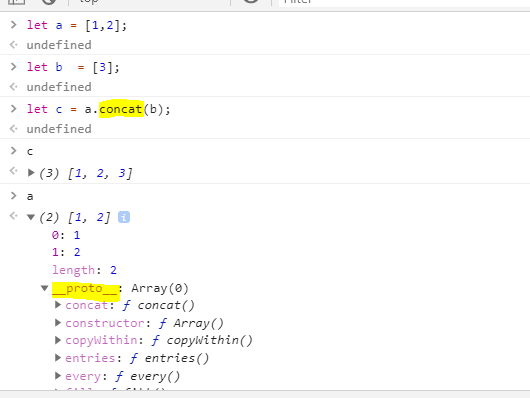
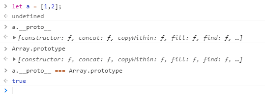

# 作用域与闭包

了解关于**作用域 & 闭包 & 原型继承**基本原理

## 作用域scope

作用域决定了代码区块中变量和其他资源的可见性。作用域最大的用处是隔离变量，不同作用域下同名变量不会冲突。

ES6之前JS只有`全局作用域`和`函数作用域`,ES6之后有了`块级作用域`

### 全局作用域

代码中任何地方都能访问的对象有全局作用域

* 最外层函数和最外层函数外面定义的变量

  ```javascript
  var outVariable = '最外层变量';
  function outFun() { // 最外层函数
    // ... 
  }
  ```

* 未定义直接赋值的变量自动声明拥有全局作用域

  ```javascript
  function outFun() {
    variable = '未定义直接赋值的变量'; // 全局
    var inVariable2 = '内层变量';
  }
  ```

* 所有window对象的属性拥有全局作用域

### 函数作用域

声明在函数内部的变量拥有局部作用域，这样函数里面的变量不会外泄暴露，不会污染到外面，例如jquery,zepto等库源码代码会放在`(function(){})()`中。

> 作用域是分层的，内层作用域可以访问外层作用域的变量，反之不行。
>
> ### 块级作用域
>
> 大括号`{}`中间的语句是块语句，如`if switch for while`

块级作用域可以通过新增命令`let/const`声明，所声明变量在指定块的作用域外无法访问，声明变量不会提升到当前代码块的顶部，禁止重复声明

```javascript
function getValue(condition) {
    if (condition) {
        let value = 'red';
        return value;
    }
    else {
        // value在此处不可用
        return null
    }
}
```

for循环的块级作用域最为必要，常见情况

```markup
<button>测试1</button>
<button>测试2</button>
<button>测试3</button>
<script type="text/javascript">
    var btns = document.getElementsByTagName('button');
    // var定义的i是全局变量，执行到点击事件时i为3，点击任意按钮都弹出“第4个”
    for (var i = 0; i < btns.length; i++) {
        btns[i].onclick = function () {
            console.log('第' + (i + 1) + '个');
        }
    }
    // let声明i是块级作用域
    for (let i = 0; i < btns.length; i++) {
        btns[i].onclick = function () {
            console.log('第' + (i + 1) + '个');
        }
    }
</script>
```

### 作用域链

一层一层寻找变量取值的关系就是作用域链

### 静态作用域

如何寻找变量的取值：要到创建函数的作用域中找，即为静态作用域`static scope/ lexical scope`

可用的变量取决于静态作用域（函数定义的位置），而不是函数调用的位置（动态作用域）

```javascript
var a = 10;
function fn() {
    var b = 20; // b取值为fn函数作用域20，最终输出结果为30
    function bar() {
        console.log(a + b); //30
    }
    return bar;
}
var x = fn(),
    b = 200;
x(); //bar()
```

### 作用域与执行上下文

> 作用域在定义时就确定，且不会改变；执行上下文\(execution context\)在运行时确定，随时可能改变

js属于解释型语言，js的执行分为`解释`和`执行`两个阶段

* 解释阶段：词法环境定义在代码所在位置，每一个执行上下文有他自己的词法环境
  * 词法分析
  * 语法分析
  * 作用域规则确定
* 执行阶段
  * 创建执行上下文：代码执行时，js引擎提供一个全局执行上下文，执行函数时会创建一个新的函数执行上下文。所有在代码里的变量都在内存堆中有内存位置，变量环境`variable environment`决定哪个变量被附在执行上下文中。
  * 执行函数代码
  * 垃圾回收

## 闭包

### 闭包的存在基于两点：

* 1.`Function`是js里的第一公民`first-class citizen`

> 第一公民支持所有操作包括：作为函数参数、函数返回值、直接赋值给变量

```javascript
// 函数表达式，即将函数赋值给一个变量
const funcSing = name => {
    return `${name} sings: La la lalala`;
};
// 函数作为参数 
const letPerson = (name, fn) => {
    return fn(name);
};
letPerson('Peter', funcSing);
// 函数作为返回值
const myName = name => {
    return () => {
        return `My name is ${name}`;
    };
};
const whatsMyName = myName('Peter'); // 返回一个函数
whatsMyName();
```

* 2.js有词法作用域（或静态作用域）`lexical scope/static scope`

### 创建闭包

函数可以使用其父函数内的变量，一个函数返回了一个函数后，其内部的局部变量还被新函数引用

```javascript
function outerFun() {
    const outer = '外部函数变量';
    return function innerFun() {
        console.log(outer);
    };
}
outerFun()();
```

### 闭包的作用

* 1.高效使用内存

```javascript
// 没有闭包时每一次调用函数都需要重新开辟array
function withOutClosure(index) {
    const arr = new Array(8000).fill('lorem ipsum olorem');
    return arr[index];
}
withOutClosure(543);
withOutClosure(654);
withOutClosure(345);
withOutClosure(135);
// 有闭包时，每次调用函数都使用的是同一个array
function withClosure() {
    const arr = new Array(8000).fill('lorem ipsum olorem');
    return function(index) {
        return arr[index];
    };
}
const findFromIndex = withClosure();
findFromIndex(20);
findFromIndex(290);
findFromIndex(4567);
```

* 2.实现封装

封装可以保护内部私有数据不泄露，不被外面使用

```javascript
function encapEg() {
    let protectedData = 0; // this is the protected data that we only want to allow read access not direct change it
    const accessTheData = () => protectedData; // this function will exported
    const updateData = ()=> protectedData++; // we want to update the protected data internall
    setInterval(updateData,1000); //this is the logic to update the data
    return {
        accessTheData // we return the function that only allow to access the protected data
    };
}
const obj = encapEg();
console.log(obj.accessTheData());
```

## 原型继承

  



变量`a`没有`concat`方法，从原型继承了`concat`方法，`a.__proto__`属性指向`Array`

* 原型链


`a.toString()`方法不是变量`a`的方法，于是js引擎查找`a.__proto__`即`Array.prototype`，`Array`也没有该方法，于是继续查找`a.__proto__.__proto__`直到最后返回。



* 检查属性是否属于对象本身而非其原型链中：`hasOwnProperty`


